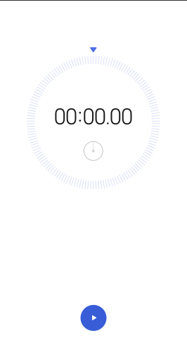
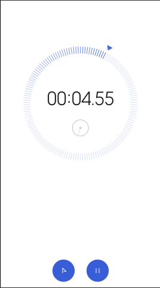
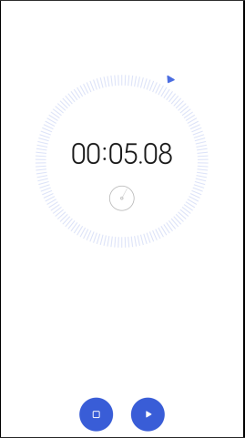
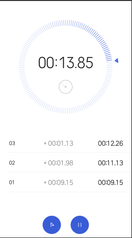
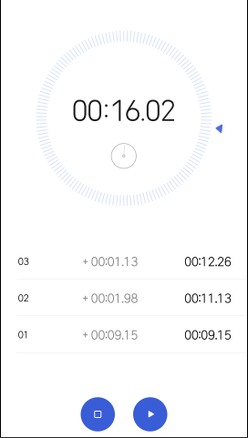

<div align="center">
  <a href="https://www.fontspace.com/category/computer"></a>
  
  <a href="#"></a>
  <a href="#"></a>
  <a href="#"></a>
</div>

<br>

## Objectiu del Repte
Aquest repte consisteix en desenvolupar una aplicació de cronòmetre que tingui l'opció de registrar els temps de manera permanent a l'emmagatzematge local del navegador. A través de la creació d'una interfície senzilla i funcional, els usuaris podran controlar el cronòmetre i guardar els seus registres de temps de forma fàcil i accessible.

Per conèixer l'aparença a dissenyar seguirem la guia de la presentació amb les imatges a continuació, que detallen la interfície de l'aplicació, la seva funcionalitat i el seu aspecte visual.

<br>

## Imatges de referència
<div align="center">
  
  
  
  
  
</div>

<br>

## Funcionalitats Principals
- **Iniciar/Pausar/Reiniciar**: Control total sobre el cronòmetre, amb la possibilitat d'aturar-lo, pausar-lo i reiniciar-lo sense perdre el temps acumulat.
- **Registrar Voltes**: Cada volta es registra amb el temps marcat i la comparació amb l'anterior, guardant aquesta informació de manera persistent a `localStorage`.
- **Emmagatzematge Local**: Les voltes es guarden en `localStorage`, permetent mantenir els registres fins i tot després de tancar o actualitzar la pàgina.

<br>

## Instal·lació i Execució
1. **Descarregar o Clonar el Repositori**: Pots descarregar o clonar aquest repositori per utilitzar-lo localment.
   - Per descarregar el repositori, utilitza el botó de "Download ZIP" a GitHub.
   - O bé, pots clonar-lo amb la següent comanda de Git:
     ```bash
     git clone https://github.com/Sailok25/Repte-3_Cronometre-amb-memoria-local.git
     ```
2. **Obrir l'Arxiu HTML**: Un cop descarregat, simplement obre el fitxer `index.html` en qualsevol navegador modern per començar a utilitzar el cronòmetre.
